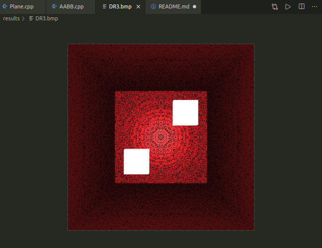

# Gráficas
Repositorio para entregas del curso Gráficas por Computadora - UVG2020

## DR3

Esta entrega amplia las funcionalidades de DR1, agregando el renderizado de planos y cubos.

Para ejecutar esta entrega se puede ejecutar en alrhivo ```.sh``` de la siguiente manera (en sistemas Linux):


En otro caso, ```g++``` funciona bien:
```
g++ *.cpp -o output #Para compilar
./output #Para ejecutar
```

Y produce el siguiente archivo en formato BMP:


