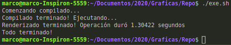
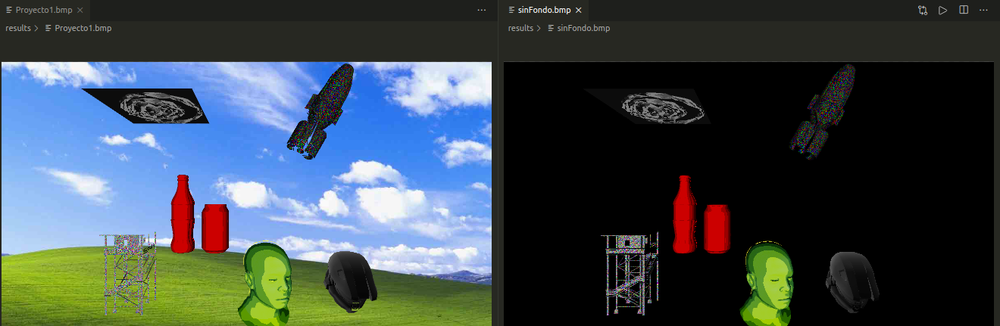

# Gráficas
Repositorio para entregas del curso Gráficas por Computadora - UVG2020

## DR1

Esta entrega re escribe varios métodos del software renderer anterior, centrándose en un algoritmo de _ray tracing_. Específicamente en esta entrega, un algoritmo de _ray intercect_ para poder rendeizar esferas.

Para ejecutar esta entrega se puede ejecutar en alrhivo ```.sh``` de la siguiente manera (en sistemas Linux):


En otro caso, ```g++``` funciona bien:
```
g++ *.cpp -o output #Para compilar
./output #Para ejecutar
```

Y produce los siguientes archivos en formato BMP:
