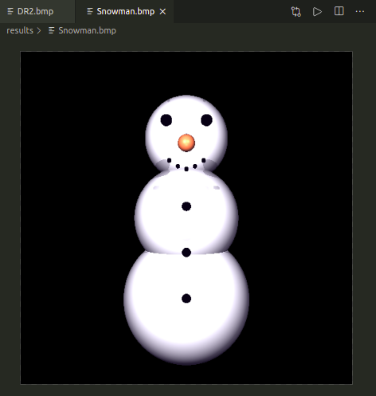
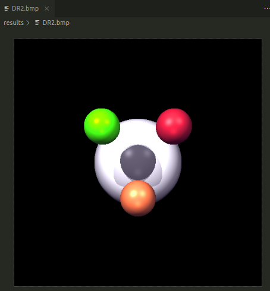

# Gráficas
Repositorio para entregas del curso Gráficas por Computadora - UVG2020

## DR2

Esta entrega amplia las funcionalidades de DR1, agregando el renderizado de sombras, proyecciones y un Phong Shader.

Además, soporta una iluminación de ambiente y cualquier cantidad de luces puntuales (point lights).

Para ejecutar esta entrega se puede ejecutar en alrhivo ```.sh``` de la siguiente manera (en sistemas Linux):


En otro caso, ```g++``` funciona bien:
```
g++ *.cpp -o output #Para compilar
./output #Para ejecutar
```

Y produce el siguiente archivo en formato BMP:



Para demostrar la funcionalidad de varias luces puntuales y una luz ambiental, se produjo esta muestra:

