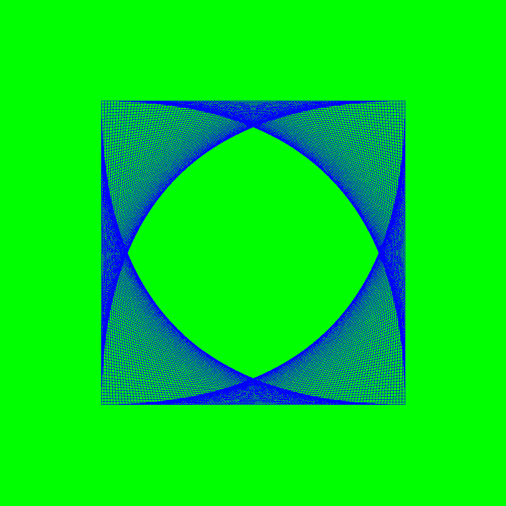
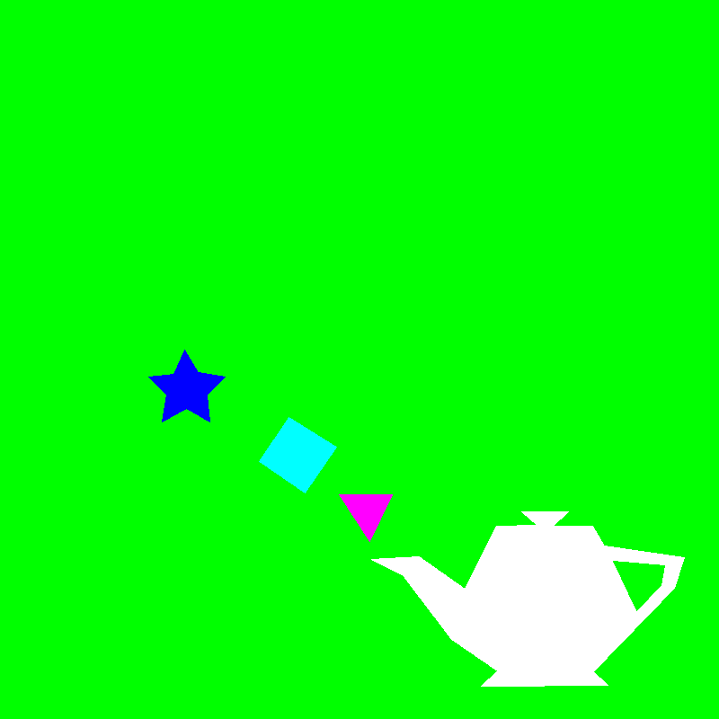

# Gráficas
Repositorio para entregas del curso Gráficas por Computadora - UVG2020

## Tarea 1: SR1

El laboratorio consiste en desarrollar un render de imágenes en formato BMP a través del desarrollo de diversas funciones (listadas a continuación). Para esta entrega se decidió desarrollar una clase Render que cuenta con los siguientes métodos públicos:
```
void glInit();
void glCreateWindow(int width, int height);
void glViewPort(int x, int y, int width , int height);
void glClear();
void glClearColor(double r,double g,double b);
void glVertex(double x, double y);
void glColor(double r, double g, double b);
void glFinish();
string toString(); //Retorna el estado de la instancia de la clase.
string getMatrix(); //Retorna la matriz de valores RBG como un string.
```

Estos métodos están todos implementados en la función ```main``` de ```SR1.cpp```.

## Tarea 2: SR2

Esta entrega se basa en ```SR1.cpp```, agregándole el método ```glLine(double x0, double y0, double x1, double y1)```, junto con algunos _helper methods_ dentro de la clase Render. 

Al correr el archivo ```SR2.cpp```, se creará ```SR2.bmp```, que sirve como evidencia de su funcionamiento:


## Laboraorio 1: Filling Any Polygon

Usando como base ```SR2.cpp``` agregándole los métodos ```pointOnPoligon``` y ```glPoligonFill```, se logró completar el rellenado de todos los polígonos. Al correr el archivo ```LAB1.cpp``` se creará ```LAB1.bmp```, que sirve como evidencia de su funcionamiento:
